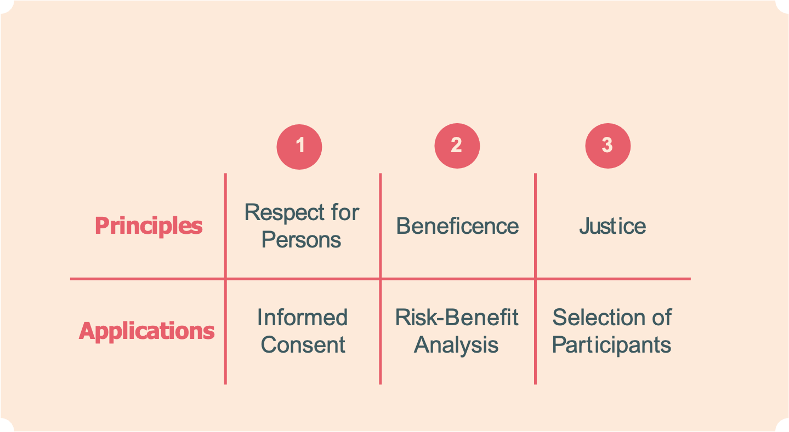

```{r setup, include=FALSE}
options(htmltools.dir.version = FALSE)
knitr::opts_chunk$set(
  fig.width=9, fig.height=3.5, fig.retina=3,
  out.width = "36%",
  cache = FALSE,
  echo = FALSE,
  message = FALSE, 
  warning = FALSE,
  fig.show = TRUE,
  hiline = TRUE
)
```

```{r xaringan-themer, include=FALSE, warning=FALSE}
library(xaringanthemer)

style_solarized_light(
  header_font_google = google_font("Arvo"),
  header_h1_font_size = "34px",
  text_font_google = google_font("Cabin"),
  text_font_size = "24px",
  code_font_google = google_font("Share Tech Mono"),
  extra_css = list(
    ".remark-slide-content h2" = list(
      "margin-top" = "2em",
      "margin-bottom" = "2em"
    ),
    .big = list("font-size" = "150%"),
    .small = list("font-size" = "75%"),
    .subtle = list(opacity = "0.6"),
    ".countdown-has-style h3, .countdown-has-style h3 ~ p, .countdown-has-style h3 ~ ul" = list(
      "margin" = "0"
    ),
    ".countdown-has-style pre" = list(
      "margin-top" = "-10px"
    ),
    "p .remark-inline-code" = list(
      "background-color" = "#6c71c41a",
      "padding" = "2px 2px",
      "margin" = "0 -2px"
    ),
    blockquote = list("margin-left" = 0),
    "em" = list(color = "#2aa198")
  )
)

```

background-image: url(milgram-experiment-man.jpeg)
background-position: center
background-size: cover
---
# Outline

1. Ethics
2. Ethical Principles
3. Ethical Codes (Belmont Report, APA)
4. Ethical Groups (IRB)

---


# Ethics

- A set of moral principles used by researchers to describe how participants in research should be treated. 
  
  - Humans do not have perfect moral compasses. Scientists are people too. History shows self-policing does not work
  
  - Tuskegee Syphilis study
  - Miligram
  - Facebook 

---

# Montser Study

<div align="center">

<iframe width="700" height="500" align="middle" src="https://www.youtube.com/embed/h5yPwWybgD4" title="YouTube video player" frameborder="0" allow="accelerometer; autoplay; clipboard-write; encrypted-media; gyroscope; picture-in-picture" allowfullscreen></iframe>


---

background-image: url(recent.png)
background-position: center
background-size: cover
---

# Ethical Issues in Research

- Four basic principles: 

  - Weighing risks against benefits

  - Acting responsibly and with integrity

  - Justice

  - Respect for Persons

---
# Ethical Issues in Research

- Weighing risks against benefits (Beneficence)

  - The benefits must outweigh the risks

- Acting with Integrity

  - Through and competent manner
  - Meeting professional obligations
  - Being Truthful! 

- Justice
  - Treat participants fairly
    - Adequate compensation
  - Equal probability of selection
  
- Respect
  - Voluntary Consent/participation
  - Privacy
  - Anonymity
---
# Ethics Codes

- Before WWII no formal ethic codes in place

  - Horrific science experiments conducted by Germans necessitated need for code
  
      - Nuremberg Code (1947)

```{r, fig.align='center', echo=FALSE, warning=FALSE,  out.width = "40%"}

knitr::include_graphics("ww2.jpg")
```

      - Helsinki Accord (1974) 
---
# Ethics Codes (Behavioral Research)
  
  - The Belmont Report (1978)
  
```{r, fig.align='center', echo=FALSE, warning=FALSE,  out.width = "70%"}


```

---

# APA Ethics Code

+ First code - 1953

	+ 2002 revision includes 10 general categories of ethical issues
	
	+ 5 general principles + 89 specific standards (not going over these)
	
	  1. Beneficence and Nonmaleficence
	  2. Fidelity and Responsibility
	  3. Integrity
	  4. Justice
	  5. Respect

???

The APA has provided leadership in formulating ethical principals and standards for behavioral research
---

# Confidentuality

- Participants have the right to privacy

- Any details must be kept confidential

  - Unless written consent is given
  
```{r, fig.align='center', echo=FALSE, warning=FALSE,  out.width = "40%"}


```
  
---

# Informed Consent

- What is in an informed consent document?

  - Description of the study

  - Description of the risks and benefits

    - Risks: Psychological, physical harm, boredom
    - Benefits: educational, new skills, treatment, etc

  - Request for consent 

   - Researcher must try to ensure participants consent to be involved

   - Participants must not be pressured in any way or suffer any negative consequences if they choose not to participate 


```{r, fig.align='center', echo=FALSE, warning=FALSE,  out.width = "40%"}


```

---

# Informed Consent

- For participants incapable (e.g., children, disabled) researcher must provide explanation and obtain consent from guardian

- Researchers need to be aware of vulnerable groups and ensure they are not abusing their position of power when gaining consent. 

---
# Right To Withdraw

- Prior to study being conducted participants must be told what the research is about and they they are free to withdraw at any time

- The participant should not suffer any negative effects because of this

- If a participant is harmed in any way throughout a study, the researcher must withdraw a participant themselves

---

# Deception

  - When used researchers must ensure no negative consequences arise from it
  
  - Must be justified
  
  - No other way of achieving the aims of the study
  
  - Participants must be debriefed at conclusion of the study
  
---

# Debriefing

- At the end of the study, participants are told more about the study 
  
- Participants given a chance to ask questions and researchers can correct any beliefs or attitudes the participants have about the research 

---
# Beyond the Participant

- Accurate reporting

  - Do not fabricate your data (https://www.youtube.com/watch?v=j-1iUY-9MFQ)
  
  - Correct errors 

- Do not Plagiarize

- Do not submit your own work that has already been submitted

- Share your data! 

---
# IRB 

.pull-left[
- IRB = Institutional Review Board 

  - at least 5 members 
  
  - at least 1 must have a scientific background
  
  - at least 1 must be a non-scientist (this member must attend a meeting to achieve quorum)
  
  - at least 1 non-affiliated member (not affiliated with the institution)
  
  - Members should have expertise in the research that will be reviewed
]

.pull-right[

- Type of IRB Review
  - Exempt
      - Research done in education settings
      - Cognitive tests, surveys, interviews, or observations of public behavior
      - Benign behavioral interventions
      - Secondary data
 - Expedited
      -  Minimal risk 
        - Biological/medical
        - Common behavioral/psychological behavioral 
 - Full review
  - More than minimal risk
]

---

# The Main Purpose of IRB Review

- To assess the risk/benefit ratio

- To ensure that informed consent is obtained in an appropriate manner

- To verify that the recruitment methods/materials are not misleading or coercive

- To ensure that the selection of subject is equitable and justified
---
# Group Activity


