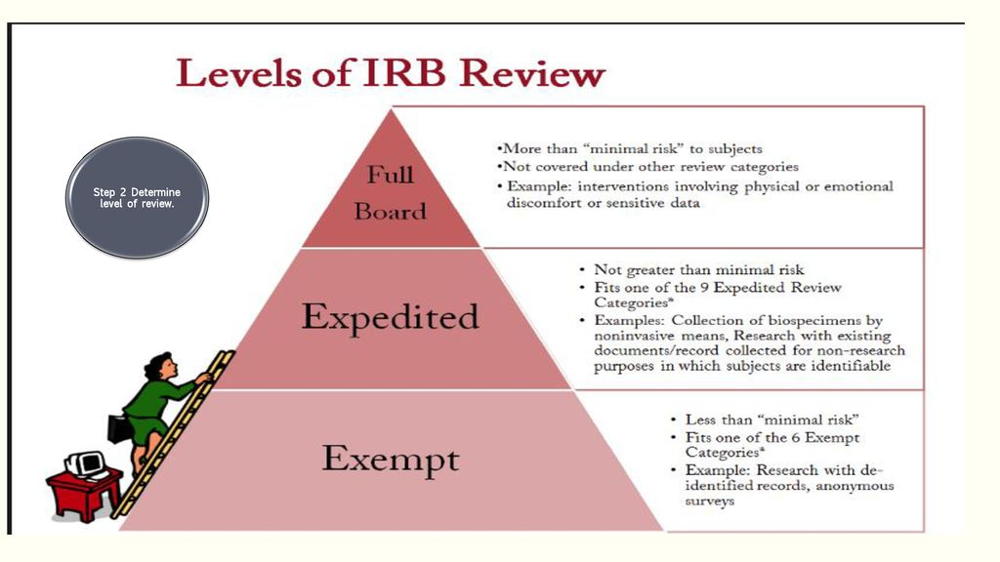

```{r setup, include=FALSE}
options(htmltools.dir.version = FALSE)
knitr::opts_chunk$set(
  fig.width=12, fig.height=8, fig.retina=3,
  out.width = "100%",
  cache = FALSE,
  echo = FALSE,
  message = FALSE, 
  warning = FALSE,
  fig.show = TRUE,
  hiline = TRUE
)

library(here)
```

```{r xaringan-themer, include=FALSE, warning=FALSE}
library(xaringanthemer)
style_duo_accent(
  primary_color = "#1381B0",
  secondary_color = "#FF961C",
  inverse_header_color = "#FFFFFF"
)
```

background-image: url(milgram-experiment-man.jpeg)
background-position: center
background-size: cover
---
# Ethics


- A set of moral principles used by researchers to describe how participants in research should be treated. 
  
  - Humans do not have perfect moral compasses. Scientists are people too. History shows self-policing doesn’t work

---

# Tuskegee Syphilis Study


<div align="center">

<iframe width="700" height="400" src="https://www.youtube.com/embed/ZV7RzS8QRXE" title="YouTube video player" frameborder="0" allow="accelerometer; autoplay; clipboard-write; encrypted-media; gyroscope; picture-in-picture" allowfullscreen></iframe>

---

# Montser Study

<div align="center">

<iframe width="700" height="500" align="middle" src="https://www.youtube.com/embed/h5yPwWybgD4" title="YouTube video player" frameborder="0" allow="accelerometer; autoplay; clipboard-write; encrypted-media; gyroscope; picture-in-picture" allowfullscreen></iframe>


---


# Ethical Issues in Research

- Four basic principles: 

  - Weighing risks against benefits

  - Acting responsibly and with integrity

  - Justice

  - Respect for Persons

---

# Ethical Issues in Research

- Weighing risks against benefits

  - The benefits must outwight the risks

- Acting with Integrity

  - Through and competent manner
  - Meeting professional obligations
  - Being Truthful! 

- Justice
  - Treat participants fairly
    - Adequate compensation
  - Equal probability of selection
  
- Respect
  - Voluntary Consent/participation
  - Privacy
  - Anonymity
---
# Ethics Codes

- Before WWII no formal ethic codes in place

  - Horrific science experiments conducted by Germans nessitated need for code
  
      - Nuremberg Code (1947)

```{r, fig.align='center', echo=FALSE, warning=FALSE,  out.width = "40%"}


```
---
# Ethics Codes
  
  - Declaration of Helsinki (1974)
  
  - The Belmont Report (1978)
  
```{r, fig.align='center', echo=FALSE, warning=FALSE,  out.width = "70%"}

knitr::include_graphics("belmont.png")
```

---

# APA Ethics Code

+ First code - 1953

	+ 2002 revision includes 10 general categories of ethical issues
	
	+ 5 general principles + 89 specific standards (not going over these)

---

# Confidentuality

- Participants have the right to privacy

- Any details must be kept confidential

  - Unless written consent is given
  
```{r, fig.align='center', echo=FALSE, warning=FALSE,  out.width = "40%"}


```
  
  
---

# Voluntary Participantion

- Researcher must try to ensure participants consent to be involved

- Participants must not be pressured in any way or suffer anyt neagtive consequences if they choose not to participate 

```{r, fig.align='center', echo=FALSE, warning=FALSE,  out.width = "40%"}

knitr::include_graphics("i-volunteer-tribute.gif")
```

---
# Right To Withdraw

- Prior to study being conducted participants must be told what the research is about and they they are free to withdraw at any time

- The participant should not suffer any negative effects becasue of this

- If a participant is harmed in any way throughout a study, the researcher must withdraw a participant themselves. 

---

# Informed Consent

- Participants should be appropriately informed of the type of study and the reasons for the research before it is conducted

- This must be a document

- Participants must be made aware of any effects of consequences the study may cause them

```{r, fig.align='center', echo=FALSE, warning=FALSE,  out.width = "40%"}


```


---

# Informed Consent

- For participants incapable (e.g., children, disabled) researcher must provide explanation and obtain consent from guardian

- Researchers need to be aware of vulnerable groups and ensure they are not abusing their position of power when gaining consent. 

---

# Informored Consent

- Deception

  - When used researchers must ensure no negative consequences arise from it
  
  - Must be justified
  
  - No other way of achieving the aims of the study
  
  - Participants must be debriefed at conclusion of the study
  
---

# Debriefing

- At the end of the study, participants are told more about the study 
  
- Participants given a chance to ask questions and researchers can correct any beliefs or attitudes the participants have about the research 

---
# Beyond the Participant

- Accurate reporting

  - Do not fabricate your data
  
  - Correct errors 

- Do not Plagiarize

- Do not submit your work that has already been submitted

- Share your data! 

---


# IRB 

.pull-left[
- IRB = Institutional Review Board 

  - at least 5 members 
  
  - at least 1 must have a scientific background
  
  - at least 1 must be a non-scientist (this member must attend a meeting to achieve quorum)
  
  - at least 1 non-affiliated member (not affiliated with the institution)
  
  - Members should have expertise in the research that will be reviewed
]

.pull-right[

```{r, echo=FALSE, warning=FALSE}



```
]

---

# The Main Purpose of IRB Review


- To assess the risk/benefit ratio

- To ensure that informed consent is obtained in an appropriate manner

- To verify that the recruitment methods/materials are not misleading or coercive

- To ensure that the selection of subject is equitable and justified
