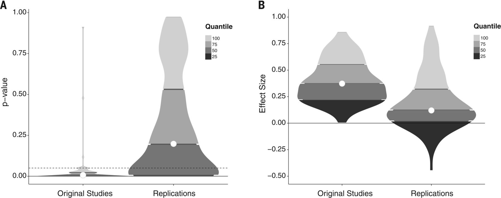
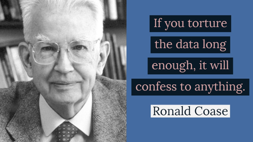
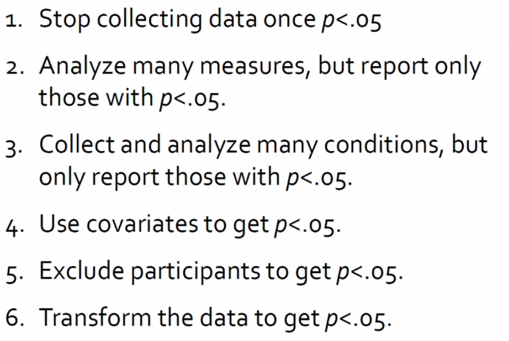
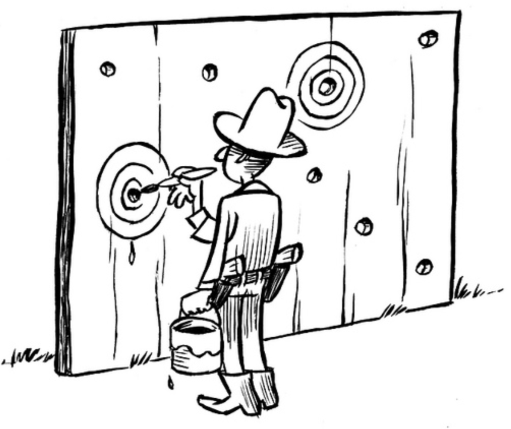
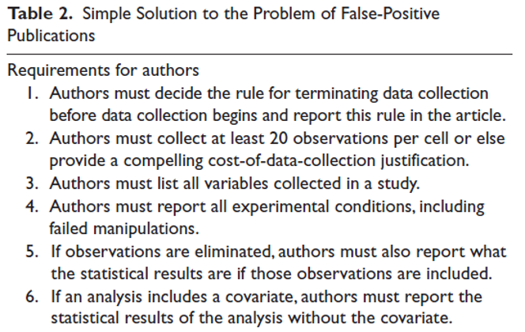
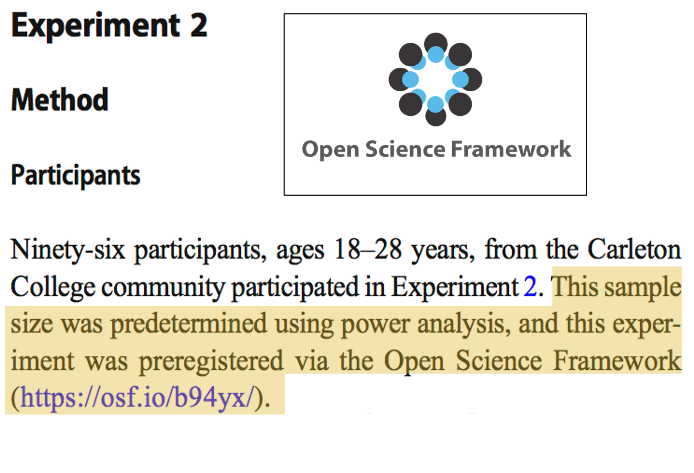
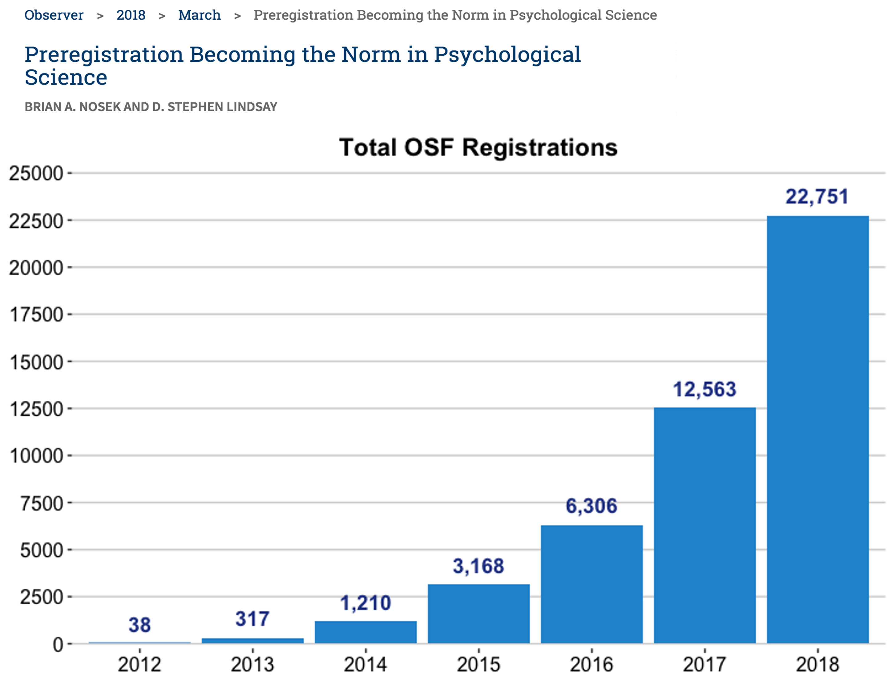
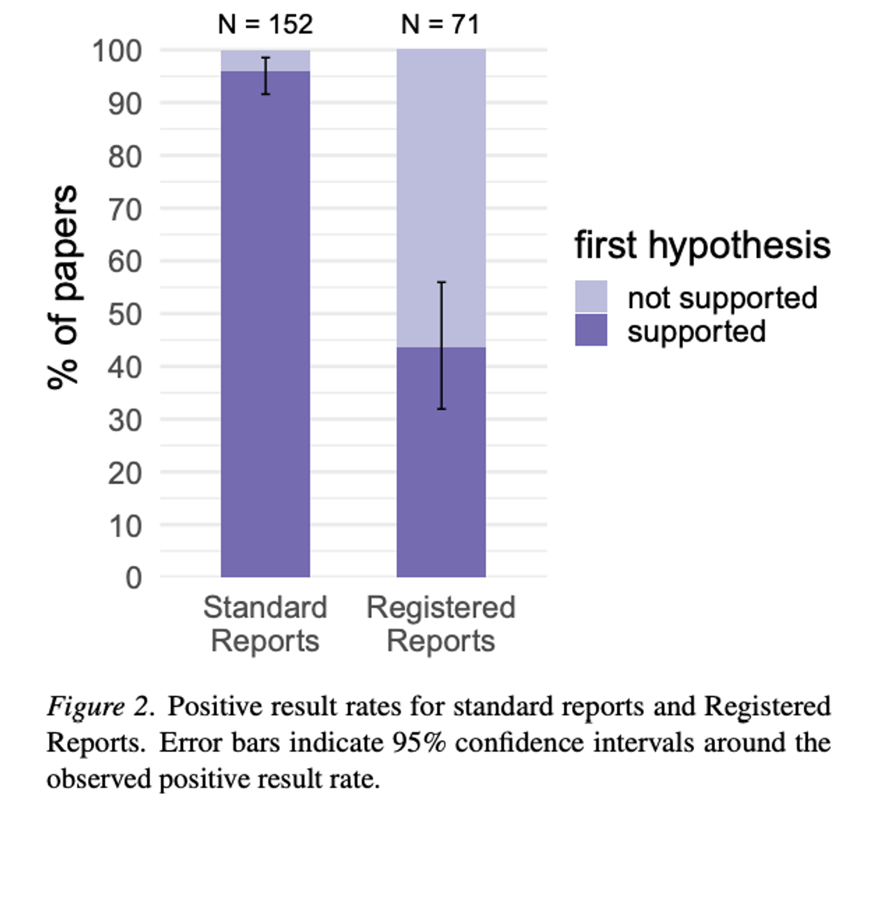
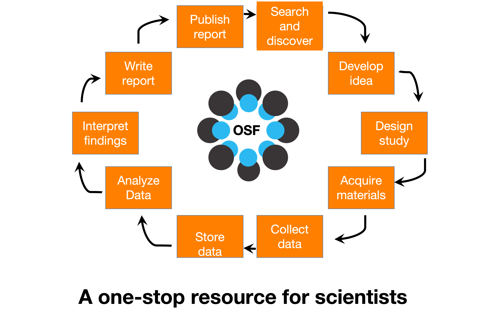

```{r setup, include=FALSE}
options(htmltools.dir.version = FALSE)
knitr::opts_chunk$set(
  fig.width=9, fig.height=3.5, fig.retina=3,
  out.width = "36%",
  cache = FALSE,
  echo = FALSE,
  message = FALSE, 
  warning = FALSE,
  fig.show = TRUE,
  hiline = TRUE
)
```

```{r xaringan-themer, include=FALSE, warning=FALSE}
library(xaringanthemer)

style_solarized_light(
  header_font_google = google_font("Arvo"),
  header_h1_font_size = "28px",
  text_font_google = google_font("Cabin"),
  text_font_size = "26px",
  code_font_google = google_font("Share Tech Mono"),
  extra_css = list(
    ".remark-slide-content h2" = list(
      "margin-top" = "2em",
      "margin-bottom" = "2em"
    ),
    .big = list("font-size" = "150%"),
    .small = list("font-size" = "75%"),
    .subtle = list(opacity = "0.6"),
    ".countdown-has-style h3, .countdown-has-style h3 ~ p, .countdown-has-style h3 ~ ul" = list(
      "margin" = "0"
    ),
    ".countdown-has-style pre" = list(
      "margin-top" = "-10px"
    ),
    "p .remark-inline-code" = list(
      "background-color" = "#6c71c41a",
      "padding" = "2px 2px",
      "margin" = "0 -2px"
    ),
    blockquote = list("margin-left" = 0),
    "em" = list(color = "#2aa198")
  )
)

```

# Poll

<iframe src="https://app.sli.do/event/fi6lqizt" height="100%" width="100%" frameBorder="0" style="min-height: 560px;" title="Slido"></iframe>

---
# Last class

---
# Outline

- The crisis in science 

- What is replication?

- The history of the replication crisis in psychology

- How we got here

- Potential solutions to the problem

- OSF/preregistraion

---
# Is Science Fucked?

<div align="center">

<iframe width="700" height="500" align="middle" src="https://www.youtube.com/embed/0Rnq1NpHdmw" title="YouTube video player" frameborder="0" allow="accelerometer; autoplay; clipboard-write; encrypted-media; gyroscope; picture-in-picture" allowfullscreen></iframe>

https://www.youtube.com/watch?v=42QuXLucH3Q

---
# Replication


```{r, fig.align='center', echo=FALSE, warning=FALSE,  out.width = "70%"}


```
---


```{r, fig.align='center', echo=FALSE, warning=FALSE,  out.width = "90%"}

knitr::include_graphics("failed.png")
```
---
# Why?
```{r, fig.align='center', echo=FALSE, warning=FALSE,  out.width = "50%"}


```

---
# How did the crisis start?

- A little history

  - 2011: Daryl Bem published a paper in JPSP (top journal) claiming to have found evidence that ESP exists

      - PsychoPy Demo 
  
  - 2011: Diederik Stapel busted for fabricating data (**58 papers retracted to date**)

  - 2011-present: Major findings (psychology) not replicated
  
     - E.g., Ego depletion, embodied cognition, power posing, social priming

  - 2015: Open Science Collaboration failed to replicate most studies in psychology
---
# Open Science Collaboration (2015)

- Open Science Collaboration attempted to replicate 100 studies published in 3 top psychology journals in 2008

- Replications used materials supplied by original authors and were high-powered 

- Results: 39% of the original studies were successfully replicated

  - 25% of social psychology studies replicated
  - 50% of cognitive psychology studies replicated
  - Effect sizes overestimated in original studies


```{r, fig.align='center', echo=FALSE, warning=FALSE,  out.width = "80%"}


```

---
# Do we have a problem?

```{r, fig.align='center', echo=FALSE, warning=FALSE,  out.width = "80%"}

knitr::include_graphics("iscrisis.png")
```

---
# Why do we have a problem?

---
# False-Positive Psychology (Simmons, Nelson, & Simonsohn, 2011)

- Researchers may engage in questionable research practices not because they intend to be dishonest.
Rather, they are motivated to make decisions that support their hypotheses

  - Make decisions so that p-value will be below .05 and can claim statistical significance

- Researcher degrees of freedom

```{r, fig.align='center', echo=FALSE, warning=FALSE,  out.width = "80%"}


```

---
# Researcher Degrees of Freedom

- Choosing a sample size - stopping data collection

- How to deal with outliers/illegitimate responses

- Which conditions/groups should be compared

- Creating variables

- Which items? Transformations?

- Which variables should be included in analyses

- IVs, DVs, controls, mediators, moderators

- What covariates do you include?

**Making each decision increases the false positive rate (Type 1 error)**
---
# Covariates

> Covariate: a variable in a statistical analysis that was typically not controlled or manipulated during data collection but was measured

- Hours awake & tantrums;  

covariate: age

---
# Where do false p values come from?

> p-hacking: trying lots of analyses until you get a desired outcome

```{r, fig.align='center', echo=FALSE, warning=FALSE,  out.width = "80%"}


```
---
# P hacking

```{r, fig.align='center', echo=FALSE, warning=FALSE,  out.width = "80%"}


```

---
# Hack your way to glory

- https://projects.fivethirtyeight.com/p-hacking/

---
# HARKing

> Hypothesizing After Results are Known (HARKing): presenting exploratory findings as confirmatory

```{r, fig.align='center', echo=FALSE, warning=FALSE,  out.width = "80%"}


```

---
# Publication bias

- Traditionally, journals were biased in favour of publishing:

  1. Significant findings
    - Non-significant findings relegated to a researcher’s “file drawer”
  2. Novel findings
    - Counterintuitive, surprising findings more likely to be published in top journals
---
# How to get publishable results


# Interim Summary

1. Researcher Degrees of Freedom lead to flexibility in how we analyze our results
2. Publication bias makes it hard to get findings that aren’t statistically significant published
3. Scientists are incentivized to publish

---
class: inverse center middle

# Does this really mean we are f**ked?

---
# Potential Solutions

```{r, fig.align='center', echo=FALSE, warning=FALSE,  out.width = "80%"}


```


---
# 21 word solution

“We report how we determined our sample size, all data exclusions (if any), all manipulations, and all measures in the study.”
---
# Potential Soloutions

- Preregistrations

- Specify all hypotheses & methodological choices in writing prior to data collection

  - Reduces RDoF
  - Can’t p-hack
  - Can’t HARK
  
```{r, fig.align='center', echo=FALSE, warning=FALSE,  out.width = "80%"}


```
---
# Potential Solutions

  - Preregistrations

```{r, fig.align='center', echo=FALSE, warning=FALSE,  out.width = "80%"}


```
---
# Potential Solutions

- Registered Reports

  - Review and acceptance prior to data collection

```{r, fig.align='center', echo=FALSE, warning=FALSE,  out.width = "80%"}

knitr::include_graphics("rrr.png")
```
---
# Potential Solutions

.pull-left[- Registered Reports

      - Reduces RDoF
      - Can’t p-hack
      - Can’t HARK
      - Reduces publication bias 
]

.pull-right[]
```{r, fig.align='center', echo=FALSE, warning=FALSE,  out.width = "50%"}


```
]

---
# Potential Solutions

- Sharing

  - Posting all data and code on OSF
  - Sharing stimulus materials, lists, etc
---
# Potential solutions

- Increased power/increased sample size

  - Simmons et al. (2011) suggest at least N = 20 per group, but this isn’t large enough
  
- Use of within-participants designs affords more power

---
# Importance of High Statistical Power

- Effects sizes in psychology are **smallish**

> Small effect sizes can only be accurately detected with high statistical power

---

# Open Science Framework

```{r, fig.align='center', echo=FALSE, warning=FALSE,  out.width = "80%"}


```


