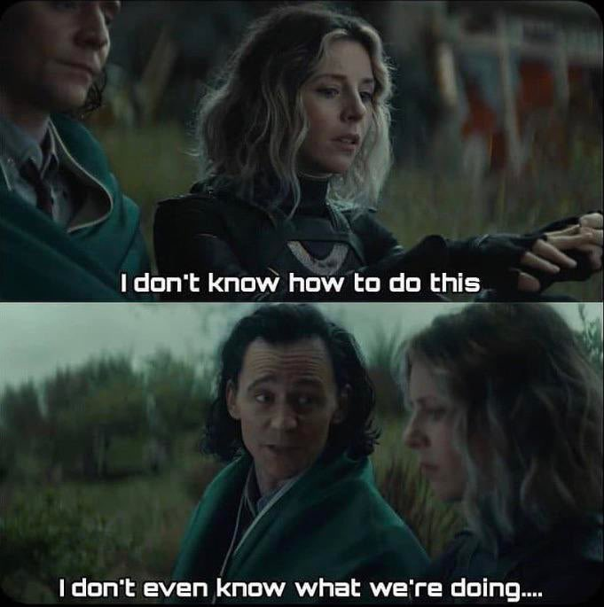

```{r setup, include=FALSE}
options(htmltools.dir.version = FALSE)
knitr::opts_chunk$set(
  fig.width=9, fig.height=3.5, fig.retina=3,
  out.width = "40%",
  cache = FALSE,
  echo = FALSE,
  message = FALSE, 
  warning = FALSE,
  fig.show = TRUE,
  hiline = TRUE
)
```

```{r xaringan-themer, include=FALSE, warning=FALSE}
library(xaringanthemer)
style_duo_accent(
  primary_color = "#1381B0",
  secondary_color = "#FF961C",
  inverse_header_color = "#FFFFFF"
)
```

class: inverse center middle

# About Me


---

# Timeline

```{r echo=FALSE, message=FALSE, warning=FALSE}

library(cronologia)
batman_data <- data.frame(

  
   date_release = c("M.S. DePaul University",
                  "Ph.D. Iowa State University",
                  "Post-doc at University of Alabama-Birmingham", 
                  "Post-doc at University of Iowa", 
                  "Research Scientist at RuCCS"), 

  title = c("2012",
                   "2017",
                   "2017",
                   "2019", 
                   "2020")
)


```

<div class="chronologia-wrapper">
  <div class="chronologia-detail-wrapper">
    <details>
      <summary style="color: blue; background: orange;">2012</summary>
      <p style="color: white; background: black; font-size: 24px;">M.S. DePaul University</p>
    </details>
  </div>
  <div class="chronologia-detail-wrapper">
    <details>
      <summary style="color: blue; background: orange;">2017</summary>
      <p style="color: white; background: black; font-size: 24px;">Ph.D. Iowa State University</p>
    </details>
  </div>
  <div class="chronologia-detail-wrapper">
    <details>
      <summary style="color: blue; background: orange;">2017</summary>
      <p style="color: white; background: black; font-size: 24px;">Post-doc at University of Alabama-Birmingham</p>
    </details>
  </div>
  <div class="chronologia-detail-wrapper">
    <details>
      <summary style="color: blue; background: orange;">2019</summary>
      <p style="color: white; background: black; font-size: 24px;">Post-doc at University of Iowa</p>
    </details>
  </div>
  <div class="chronologia-detail-wrapper">
    <details>
      <summary style="color: blue; background: orange;">2020</summary>
      <p style="color: white; background: black; font-size: 24px;">Research Scientist at RuCCS</p>
    </details>
  </div>
</div>

---
# Research Interests

- Language processing
  - Mechanisms and representations
    - Auditory and visual word recognition
    - Semantics
  - `Under ambiguity`
--

- Learning and memory

  - Metamemory
  - Desirable Difficulties
-- 
- Meta-research (philosophy of science)

  - Replication issues in psychology and neuroscience
---
# Skills

- Eye-tracking

- EEG

- fMRI

- Data Analysis/visualization

- Online data collection
---

# Ice Breaker

- Name

- Year 

- Major

- Two truths and a lie

---

class: inverse center middle

# Syllabus

---

# Instructor Contact: 

- Office: RuCCS A122

- `jason.geller@ruccs.rutgers.edu`

- Cell: 515-520-3464

---
# Office Hours:


- MW: 1:00 P.M. - 3:00 P.M.

---

# Course Content:

- https://cogscimethods.netlify.app/
---

# Required Text:

- Jhangiani, R. S., Chiang, I.-C. A., Cuttler, C., & Leighton, D. C. (2019). Research Methods in Psychology.         https://doi.org/10.17605/OSF.IO/HF7DQ https://kpu.pressbooks.pub/psychmethods4e/. 
  
- Peirce, J., & MacAskill, M. (2018). Building Experiments in PsychoPy (1st edition). SAGE Publications Ltd.         (https://drive.google.com/file/d/1JVPM8aRq9d1xuQutJgg8klmUO0PEf8Yd/view?usp=sharing)

*Handful of articles I will put up on the course website (and Canvas)*

---

# Learning Goals:

1. Be able to evaluate a broad range of methods in cognitive science and consider how they suit various research questions

2. Understand basic principles of experimental design and how to move from a general idea to a specific research question

3. Consider ethical questions and the role of the Institutional Review Board

4. Find appropriate background literature suitable to particular research questions

5. Program your own experiment in Python/PsychoPy and take your research online

---
# Assignments:

- **50%** (Group Project)
  - Group Project Proposal (5%) (group)
    
  - CITI Training and Institutional Review Board (IRB) Forms (5%) (individual)
    
  - Preregistration (5%) (group)

  - Programmed Experiment (10%) (group)
     
  - Data Analysis (5%)(group)
    
  - Group presentation (10%) (group)

- **20%** (Assignments)

- **20%** (Presentation Reflections)

- **10%** (Project write-up and extension)(own)

---

# Group Project

```{r, fig.align='center', echo=FALSE, warning=FALSE}



```
---

# Absences:

- We are all adults here :). 

---

# Cheating and Plagiarism

```{r, fig.align='center', echo=FALSE, warning=FALSE}

knitr::include_graphics("cheating.jpeg")
```

---

# Disability Services:

- I am committed to the creation of an inclusive and safe learning environment for all students 

- If you need accomdatios please reach out to The Office of Disability Services (ODS)
  - More information can be found at www.ods.rutgers.edu. 
  - You can contact ODS at (848)445-6800 or via email at dsoffice@echo.rutgers.edu.

---

# Diversity and Inclusion Statement

I would like to create a learning environment for my students that supports a diversity of thoughts, perspectives and experiences, and honors your identities (including race, gender, class, sexuality, religion, ability, SES, etc. ) To help accomplish this:

 - If you have a name and/or set of pronouns that differ from those that appear in your official Rutgers records, please let me know!

- If you feel like your performance in the class is being impacted by your experiences outside of class, please don't hesitate to come and talk with me. I want to be a resource for you. Remember that you can also submit anonymous feedback (which will lead to me making a general announcement to the class, if necessary to address your concerns). 

- I (like many people) am still in the process of learning about diverse perspectives and identities. If something was said in class (by anyone) that made you feel uncomfortable, please talk to me about it. (Again, anonymous feedback is always an option).

---

class: class: inverse center middle

# Survey (https://forms.gle/9YG32UKzirUmqLu1A)
---

name: colors

## Colors

- <span style="color: var(--text-color)">Text Color</span>

- <span style="color: var(--header-color); font-family: var(--header-font-family);">Header Color</span>

- <span style="color: var(--link-color)">Link Color</span>

- <span style="color: var(--text-bold-color); font-weight: bold;">Bold Color</span>

- `inline code color`

---

# Big Topic or Inverse Slides `#`

## Slide Headings `##`

### Sub-slide Headings `###`

#### Bold Call-Out `####`

This is a normal paragraph text. Only use header levels 1-4.

##### Possible, but not recommended `#####`

###### Definitely don't use h6 `######`

---
class: inverse center middle

# Topic Changing Interstitial

--

```
class: inverse center middle
```

---
layout: true

## Blocks

---

### Blockquote

> This is a blockquote following a header.
>
> When something is important enough, you do it even if the odds are not in your favor.

---

### Code Blocks

#### R Code

```{r eval=FALSE}
ggplot(gapminder) +
  aes(x = gdpPercap, y = lifeExp, size = pop, color = country) +
  geom_point() +
  facet_wrap(~year)
```

#### JavaScript

```js
var fun = function lang(l) {
  dateformat.i18n = require('./lang/' + l)
  return true;
}
```

---

### More R Code

```{r eval=FALSE}
dplyr::starwars %>% dplyr::slice_sample(n = 4)
```

---

```{r message=TRUE}
cli::cli_alert_success("It worked!")
```

--

```{r message=TRUE}
message("Just a friendly message")
```

--

```{r warning=TRUE}
warning("This could be bad...")
```

--

```{r error=TRUE}
stop("I hope you're sitting down for this")
```


---
layout: true

## Tables

---

```{r}
tibble::as_tibble(mtcars)
```

---

```{r}
knitr::kable(head(mtcars), format = 'html')
```

---

```{r}
DT::datatable(head(mtcars), fillContainer = FALSE, options = list(pageLength = 4))
```

---
layout: true

## Lists

---

.pull-left[
#### Here is an unordered list:

*   Item foo
*   Item bar
*   Item baz
*   Item zip
]

.pull-right[

#### And an ordered list:

1.  Item one
1.  Item two
1.  Item three
1.  Item four
]

---

### And a nested list:

- level 1 item
  - level 2 item
  - level 2 item
    - level 3 item
    - level 3 item
- level 1 item
  - level 2 item
  - level 2 item
  - level 2 item
- level 1 item
  - level 2 item
  - level 2 item
- level 1 item

---

### Nesting an ol in ul in an ol

- level 1 item (ul)
  1. level 2 item (ol)
  1. level 2 item (ol)
    - level 3 item (ul)
    - level 3 item (ul)
- level 1 item (ul)
  1. level 2 item (ol)
  1. level 2 item (ol)
    - level 3 item (ul)
    - level 3 item (ul)
  1. level 4 item (ol)
  1. level 4 item (ol)
    - level 3 item (ul)
    - level 3 item (ul)
- level 1 item (ul)

---
layout: true

## Plots

---

```{r plot-example}
library(ggplot2)
(g <- ggplot(mpg) + aes(hwy, cty, color = class) + geom_point())
```

---

```{r plot-example-themed}
g + xaringanthemer::theme_xaringan(text_font_size = 16, title_font_size = 18) +
  ggtitle("A Plot About Cars")
```

---
layout: false

## Square image

<center></center>

.footnote[GitHub Octocat]

---

### Wide image


.footnote[Wide images scale to 100% slide width]

---

## Two images

.pull-left[

]

.pull-right[

]

---

### Definition lists can be used with HTML syntax.

<dl>
<dt>Name</dt>
<dd>Godzilla</dd>
<dt>Born</dt>
<dd>1952</dd>
<dt>Birthplace</dt>
<dd>Japan</dd>
<dt>Color</dt>
<dd>Green</dd>
</dl>

---
class: center, middle

# Thanks!

Slides created via the R packages:

[**xaringan**](https://github.com/yihui/xaringan)<br>
[gadenbuie/xaringanthemer](https://github.com/gadenbuie/xaringanthemer)

The chakra comes from [remark.js](https://remarkjs.com), [**knitr**](http://yihui.name/knitr), and [R Markdown](https://rmarkdown.rstudio.com).
